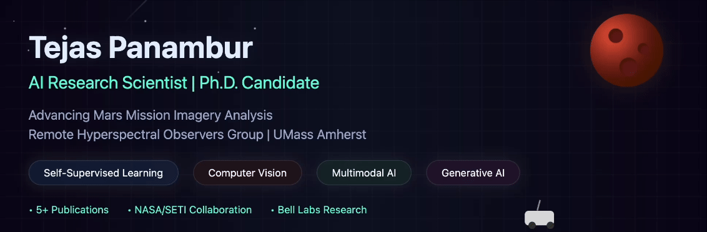

## Hi there 👋

## About Me
I’m an AI Research Scientist and Ph.D. Candidate working on advanced Mars mission imagery analysis.

## Highlights
- NASA/SETI Collaboration
- 5+ Publications
- Expertise in Self-Supervised Learning, Computer Vision, and Generative AI
